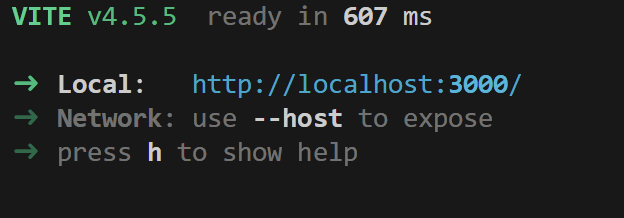

# Portfol.io

## Link
rajahassanzafar.netlify.app/

## Description

React project website with frontend usage using Vite and TypeScript. The website deploys at a live url
and to display my own job portfolio for potential employers. There is a headers with contact and about me, project/portfolio section with screenshots and github URLs to the deployed application of each project, and footer to showcase my social medias and how to further connect with me.

## Table of Contents (Optional)

If your README is long, add a table of contents to make it easy for users to find what they need.
- [Link](#link)
- [Description](#description)
- [Installation](#installation)
- [Usage](#usage)
- [Credits](#credits)
- [License](#license)
- [Badges](#badges)
- [Features](#features)
- [Contribute](#how-to-contribute)
- [Tests](#tests)

## Installation

1. In the command line, navigate to the desired parent folder and run `npm create vite`.

   - 🔑 _Note_: This command will automatically create a sub-folder which will house your React application; you do not need to perform a `mkdir` command to create one manually.

2. Enter the desired name of your new project folder.

3. From the first list of options, select your framework; for our activities in class, we'll be using `React`.

4. From the second list of options, select ycdour variant; for our activities in class, we'll be using `JavaScript`.

5. `cd` into your newly created project folder and run `npm install`.

   - In later activities we'll add additional NPM packages to our `vite` apps such as 'bootstrap', 'dotenv', and 'axios'.

6. Run `npm dev`/`npm run dev` and navigate to the prompted URL to see your app.

## Usage

## Credits

No collaborators

## License

- **MIT License**  
  This project is licensed under the [MIT License](https://opensource.org/licenses/MIT).

- **TypeScript**  
  This project uses TypeScript, which is licensed under the [Apache License 2.0](https://www.apache.org/licenses/LICENSE-2.0).

- **React**  
  This project uses React, which is licensed under the [MIT License](https://opensource.org/licenses/MIT).

## Badges

- **TypeScript**  
  This project uses TypeScript, which is licensed under the [Apache License 2.0](https://www.apache.org/licenses/LICENSE-2.0).

- **React**  
  This project uses React, which is licensed under the [MIT License](https://opensource.org/licenses/MIT).

## Features

- A customizable, user-friendly, and vibrant UI designed to help users easily navigate through each section of my job portfolio, allowing seamless interaction via both typing and point-and-click.
- Interactive screenshots and clickable links provide easy access to key content for detailed exploration.
- A dedicated "Resume" section lets you view and download my resume directly to your local device.
  You can reach out to me personally via email for further inquiries or discussions.

## How to Contribute

Fork and clone repo with changes on your own branch and make a PR and successfully commit and contribute.

## Tests

Make tests folder and run the command: npm run tests
